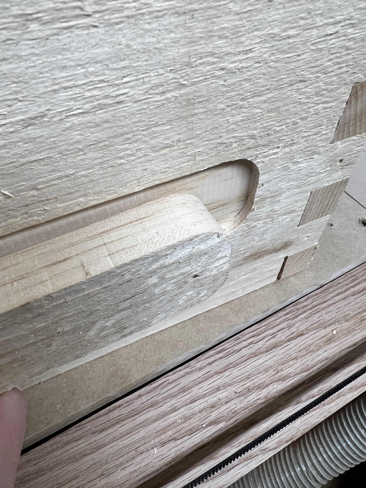
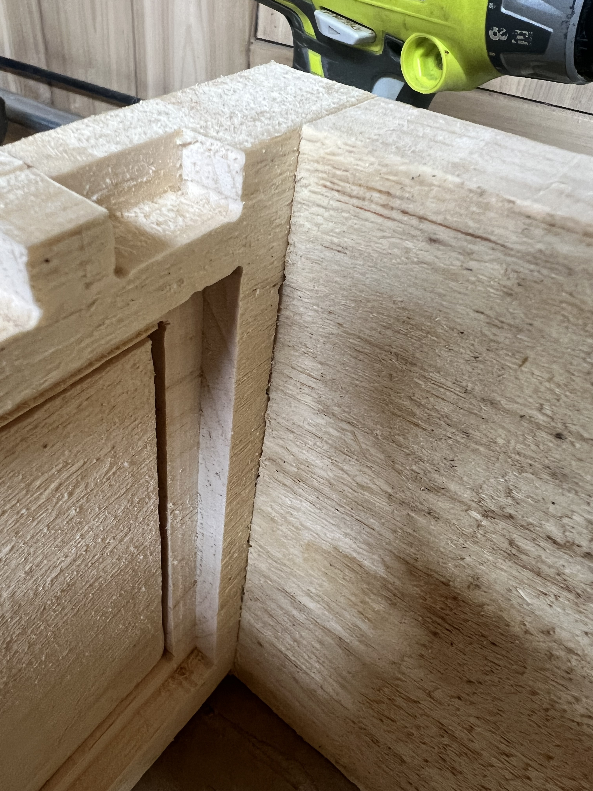
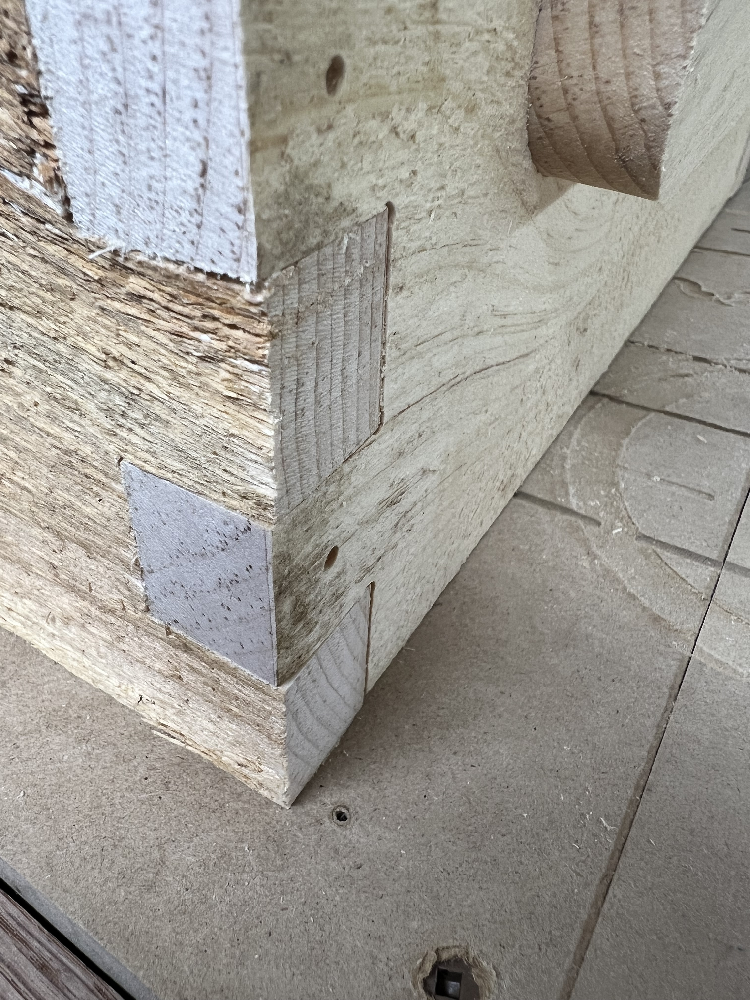
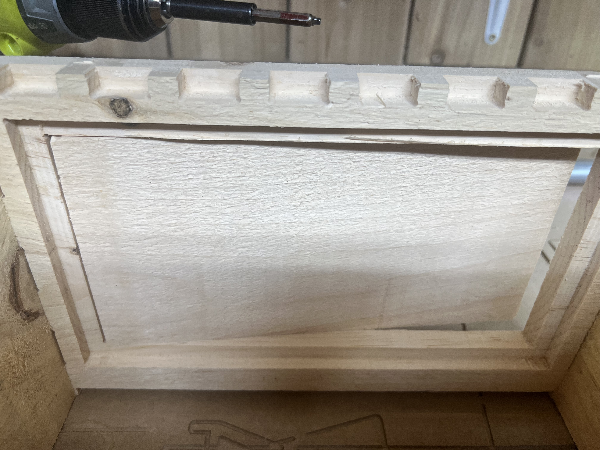
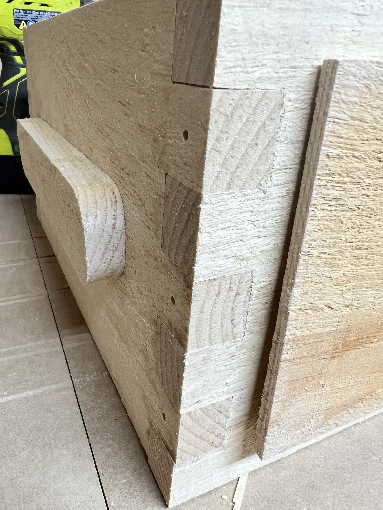

# Warre Hive CNC SVG Files

This repository contains SVG files for CNC cutting parts to build a Warre hive for beekeeping. The parts are designed to be cut from a single piece of pine board, such as the [Irving 1-inch x 12-inch x 8-ft Rough Knotty Pine Board](https://www.homedepot.ca/product/irving-1-inch-x-12-inch-x-8-ft-rough-knotty-pine-board/1000113397).

## Contents

- `base_2_parts_23_5.svg`: SVG file for the base parts of the hive.
- `roof_parts1_23_5.svg`: SVG file for the roof parts of the hive.
- `warre_small_box_23.5mmx10in.svg`: SVG file for the small box (super) of the hive.
- `warre-hive-roof_23_5.svg`: SVG file for the hive roof.
- `ESTLCAM_Project Files/`: Example ESTLCAM v11 project files showing cut types (pocket/part) and depth settings for reference.
    - `base_2_parts_23_5.e10`: ESTLCAM v11 project for the base parts
    - `roof_parts1_23_5.e10`: ESTLCAM v11 project for the roof parts
    - `warre_small_box_23.5mmx10in.e10`: ESTLCAM v11 project for the small box (super)
    - `bars_7.nc`: Example G-code output for CNC machines

## Usage

1. Obtain a suitable pine board (1" x 12" x 8').
2. Use a CNC machine to cut the parts from the SVG files.
3. Assemble the cut pieces to build a complete Warre hive.
4. Refer to the ESTLCAM project files for examples of how to set up cut types (pocket/part) and appropriate cutting depths in your CNC software.

## More Information

For a detailed discussion of the design process, finger joint techniques, and CNC setup, see the V1 Engineering Forum thread: [Impressed with Finger Joints for Beehives (Warre)](https://forum.v1e.com/t/impressed-with-finger-joints-for-beehives-warre/47693/1)

### Example Photos

 